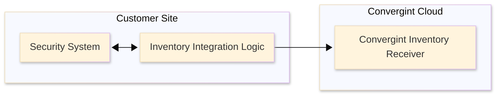

# A Path to On-Prem Security Integration

## Context

We’re exploring faster, cleaner ways to integrate with Lenel OnGuard and Milestone on-prem systems. This doc outlines what we’re looking for and how you, as our integration partner, might already be positioned to help. We’ll walk through what we need, what’s flexible, and where we’re looking for alignment with what you’ve already built.

## Scope

We’re looking for two core capabilities from your system:

1. **Asset Inventory**
    - Pull a full list of security devices for a given Convergint customer.
    - The integration should be programmatic; SDK, library, API, or other approach that gets the job done.
2. **Device Health Events**
    - Ideally, your system supports a subscription model for online/offline status updates.
    - If not, the inventory response should include the most recent known device status, accurate and current enough to be useful.

Every payload, whether inventory or health event, should contain enough metadata to reliably map devices to Convergint customer accounts.

## Minimum Data Requirements

At a minimum, we need the following fields for each device:

**Inventory**

- Unique device ID
- Device name or label
- **Device type** (camera, door, etc.)
- Customer identifier
- Online/offline status (optional if covered in events)
- MAC address (if available)

**Health Events**

- Unique device ID
- **Status**
- Timestamp

**Nice to Have**

- IP
- Hostname
- Device location or zone
- Last seen timestamp (if not covered in health events)

## Target Workflows

These workflows describe what we're ultimately trying to support. We don't expect a 1:1 match, but this should help you assess how close you are.

**1. Inventory Sync**

- A job runs on a schedule or is triggered manually or by an external system (e.g. RPC).
- The integration logic fetches device inventory from the security system.
- A normalized list is pushed to Convergint Cloud.



**2. Real-Time Health Events**

- The adapter subscribes to online/offline device status events.
- Events are forwarded as they happen.
- If real-time is unavailable, status is pulled during inventory sync.

    ```mermaid
    ---
    config:
      theme: base
      look: neo
    ---
    sequenceDiagram
        box Customer Site
            participant SecuritySystem as Security System
            participant Adapter
        end
        box Convergint Cloud
            participant Cloud as Event Receiver
        end

        Adapter->>SecuritySystem: Subscribe to health events
        SecuritySystem->>SecuritySystem: Device goes offline
        SecuritySystem-->>Adapter: Notify device status change
        Adapter-->>Cloud: Forward normalized event
    ```


## Example Payloads

We're not prescriptive about protocols. HTTP-based APIs are preferred, but if your system exposes device data via a local SDK, socket, or lighter-weight transport, that's workable. We're most interested in getting to the data reliably. How you surface it is up to you.

**Inventory Payload**

```json
{
  "devices": [
    {
      "id": "abc-123",
      "name": "Main Lobby Camera",
      "type": "camera",
      "customer_id": "convergint-001",
      "status": "online",
      "mac_address": "00:1B:44:11:3A:B7",
      "ip": "192.168.1.10"
    },
    {
      "id": "def-456",
      "name": "East Entrance Reader",
      "type": "access_control",
      "customer_id": "convergint-001",
      "status": "offline",
      "mac_address": "00:1B:44:22:4C:F3",
      "ip": "192.168.1.11"
    }
  ]
}
```

**Health Event Payload**

```json
{
  "device_id": "abc-123",
  "status": "offline",
  "timestamp": "2024-05-19T14:35:22Z"
}
```

## Integration Lifecycle

This describes how the integration could behave once deployed:

1. **Startup**
    - Load configuration (e.g. credentials, endpoint definitions)
    - Connect to the target system
    - Register for event subscriptions if supported
2. **Sync / Collection**
    - Poll for inventory on a schedule
    - Listen for real-time status events if available
3. **Normalization**
    - Map incoming data to a consistent format and schema
4. **Delivery**
    - Push data to Convergint Cloud via HTTPS or similar mechanism
    - Use retry logic or queueing for transient failures
5. **Monitoring & Logging**
    - Emit activity logs such as last sync time, event counts, errors, etc.
    - Optionally expose a healthcheck or heartbeat endpoint

## Next Steps

We're intentionally keeping the design flexible to meet you where you are technically. That said, we do have a clear set of needs and a preferred direction. To move forward, we'd like to understand:

- Which of the target workflows you can support today
- Where there are gaps (if any), and what it would take to bridge them
- What protocol(s) and tooling you prefer to work with
- Whether you have an existing integration in place we can build from

If you're already exposing this kind of data, great. If not, we're open to collaborating on what's feasible. We're happy to provide a mock endpoint or test environment to help with validation. Our main goal is to surface relevant device information cleanly, reliably, and in a way that aligns with your existing systems.

*For questions or next steps, contact:*

**Ryan Johnston** – [ryan.johnston@convergint.com](mailto:ryan.johnston@convergint.com) Director Engineering

**Juan Pemberthy** – [juan.pemberthy@convergint.com](mailto:juan.pemberthy@convergint.com) Principal Software Engineer
